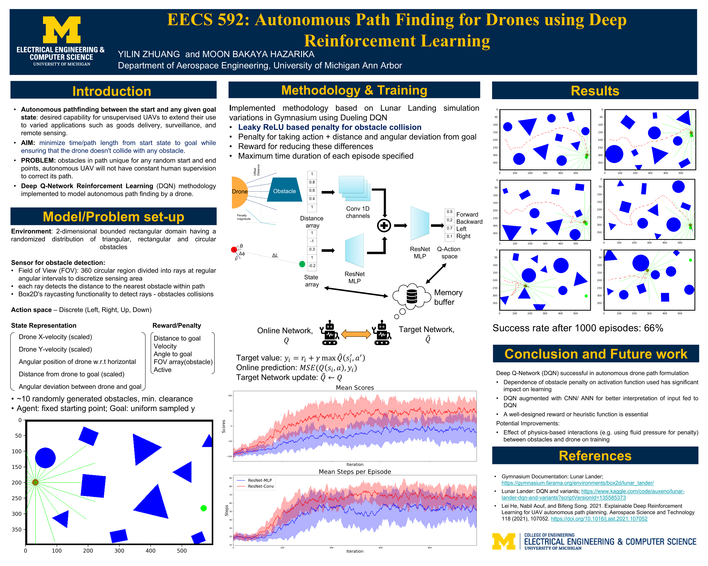

# Autonomous Drone Path Finding Using Deep Q-Network (DQN)



## Overview

This project explores autonomous path planning for drones using a Deep Q-Network (DQN) approach. The simulation environment is built with [Gymnasium](https://gymnasium.farama.org/), [Box2D](https://pybox2d.readthedocs.io/), and [Pygame](https://www.pygame.org/), while the neural network and DQN agent are implemented in [PyTorch](https://pytorch.org/). A key innovation in our approach is the use of a **leaky ReLU** activation function as a penalty mechanism for obstacle collisions, which plays a significant role in shaping the drone’s learning behavior.

## Project Structure

The project is organized into two main Python modules:

- **`uav_sim.py`**  
  Contains the simulation environment for the drone. It utilizes a configuration dataclass (`UAVSimConfig`) that encapsulates all the global parameters (e.g., UAV size, sensor parameters, obstacle properties). This file implements the drone’s physics, obstacle generation, collision detection, and reward computation (including the leaky ReLU penalty).

- **`nn_agent.py`**  
  Contains the neural network models, the DQN agent, replay buffer, and training routines. The DQN is augmented with CNN/ANN layers to better interpret the input from the simulation environment. Parameters required by the network (e.g., number of UAV sensor rays) are passed via the network’s initializer.

- **`demo.ipynb`**  
  Contains a Jupyter notebook that demonstrates the training and visualization of the drone’s path.

## Installation

```bash
python -m venv simpleuav
source simpleuav/bin/activate

pip install torch==2.4.1 torchvision==0.19.1 torchaudio==2.4.1 --index-url https://download.pytorch.org/whl/cu118
pip install swig
pip install gymnasium[box2d]
pip install pygame
pip install numpy
pip install matplotlib
pip install ipykernel
```